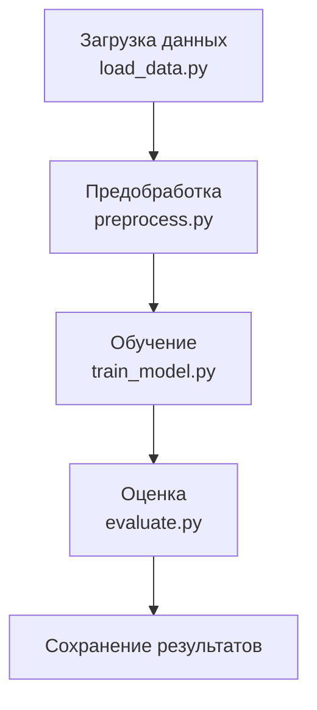

# Breast Cancer ML Pipeline — Автоматизация с Apache Airflow

## Описание проекта

Проект реализует воспроизводимый конвейер машинного обучения (ETL/ML-пайплайн) для задачи классификации опухолей молочной железы. Он включает в себя:

- Загрузку и обработку медицинских данных (Breast Cancer Wisconsin).
- Обучение модели логистической регрессии.
- Расчет метрик качества.
- Управление пайплайном с помощью Apache Airflow.
- Сохранение результатов на диск.

Работа выполнена в рамках экзамена по курсу **"Инжиниринг данных"**.

---

## Цель проекта

Разработать и реализовать автоматизированный пайплайн, способный ежедневно обрабатывать медицинские данные, обучать модель и сохранять результаты. Задача ML: **бинарная классификация** (диагностика злокачественной или доброкачественной опухоли).

---

## Архитектура и структура проекта


├── dags/                      # DAG для Apache Airflow
│   └── pipeline_dag.py
├── etl/                       # Скрипты пайплайна
│   ├── load_data.py
│   ├── preprocess.py
│   ├── train_model.py
│   ├── evaluate.py
│   ├── config.py
│   └── logger.py
├── results/                   # Модель и метрики
├── logs/                      # Лог-файлы
├── preprocessed/              # Предобработанные данные
├── Makefile                   # CLI-команды
├── requirements.txt           # Зависимости
└── README.md                  # Документация
```

---

## Описание этапов

| Этап             | Описание                                                                           |
| ---------------- | ---------------------------------------------------------------------------------- |
| `load_data.py`   | Загружает датасет Breast Cancer из библиотеки `sklearn`, сохраняет как CSV.        |
| `preprocess.py`  | Выполняет нормализацию признаков (`StandardScaler`) и кодирует целевую переменную. |
| `train_model.py` | Обучает модель `LogisticRegression` и сохраняет `.pkl`.                            |
| `evaluate.py`    | Загружает модель, делает предсказания и сохраняет метрики (`.json`).               |

---

## Инструкция по запуску

### 1. Локальный запуск

```bash
make all        # Полный запуск всех шагов
make clean      # Очистка результатов
```

### 2. Запуск через Airflow

```bash
# Проверка DAG
airflow dags list

# Ручной запуск
airflow dags trigger ml_pl

# Тестирование задачи
airflow tasks test download_data 2025-06-17
```

**DAG ID**: `ml_pl`

---

## Хранение и интеграция

* Все артефакты сохраняются **локально** в папке `results/`.
* Возможна адаптация под Google Drive, Dropbox или Amazon S3 с помощью API и `.env`/OAuth.
* Все пути задаются централизованно через `etl/config.py`.

**Структура `results/`:**

```
results/
├── model.pkl
└── metrics.json
```

---

## Обоснование архитектурных решений

* **Модульная структура**: каждый шаг разбит на отдельные скрипты, упрощая поддержку и повторное использование.
* **Логгирование**: каждый этап логирует информацию в отдельный файл — полезно при отладке.
* **Airflow DAG**: обеспечивает оркестрацию, переиспользуемость и мониторинг шагов.
* **BashOperator** в DAG: упрощает интеграцию пайплайна без дополнительной упаковки кода.
* **Конфигурация в одном файле** (`config.py`): все пути и параметры централизованы.

---

## Обработка ошибок и устойчивость

* Все скрипты обернуты в `try/except` с логгированием через `logger.exception(...)`.
* Airflow настроен на:

  * `retries` при ошибке;
  * `timeout` задачи;
  * `on_failure_callback` для уведомления.

### Пример сбоев и реакции:

| Шаг              | Возможная ошибка    | Поведение                |
| ---------------- | ------------------- | ------------------------ |
| `load_data.py`   | Файл не найден      | Логгирование + остановка |
| `preprocess.py`  | Ошибка нормализации | Исключение + лог         |
| `train_model.py` | Ошибка обучения     | Прерывание + лог         |
| `evaluate.py`    | Поврежденная модель | Лог + исключение         |

---

## Идеи по улучшению

* Сохранять версии моделей с датой (`model_YYYY-MM-DD.pkl`);
* Визуализировать метрики (e.g., с помощью matplotlib/plotly);
* Интеграция с MLflow;
* Подключение Telegram-уведомлений;
* Расширение на другие типы моделей (e.g., RandomForest, XGBoost).

---

## DAG в Airflow


---

## Установка зависимостей

```bash
pip install -r requirements.txt
```

---

## Makefile (пример)

```makefile
all:
	python -m etl.load_data
	python -m etl.preprocess
	python -m etl.train_model
	python -m etl.evaluate

clean:
	rm -rf results/*
	rm -rf preprocessed/*
```

---

## Минимальные требования

* Airflow 2.x
* Python 3.10+
* pandas, sklearn, joblib

---
